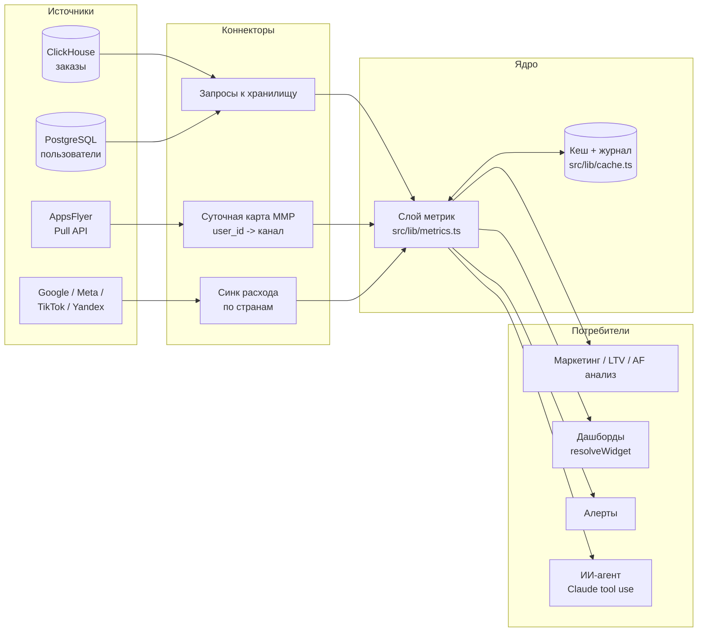
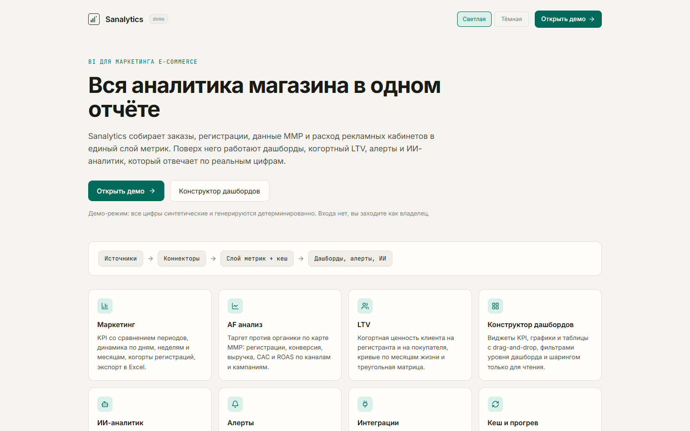
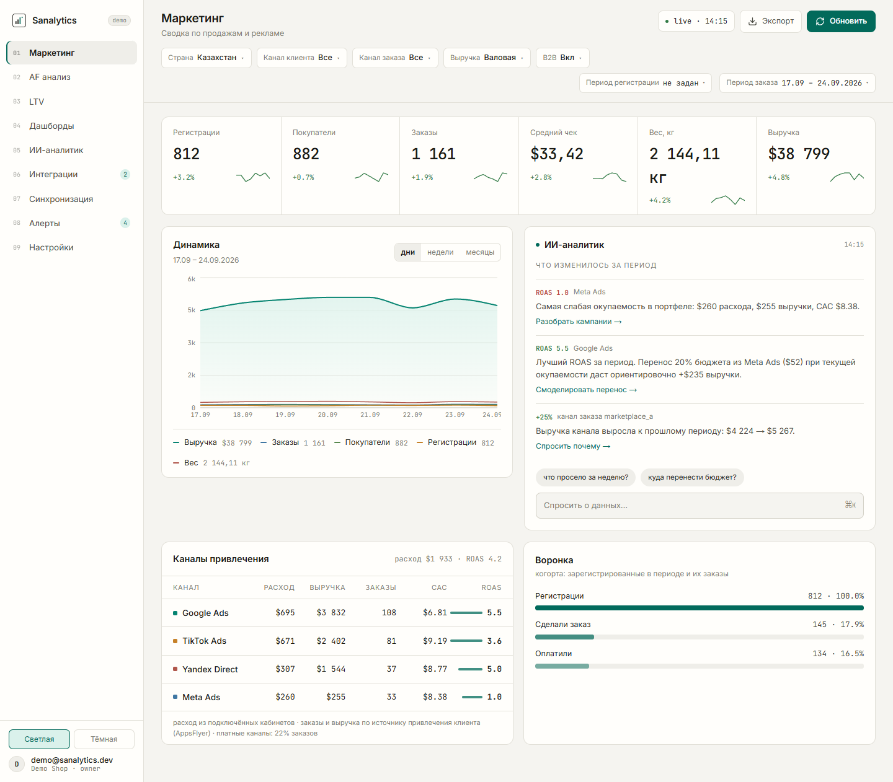
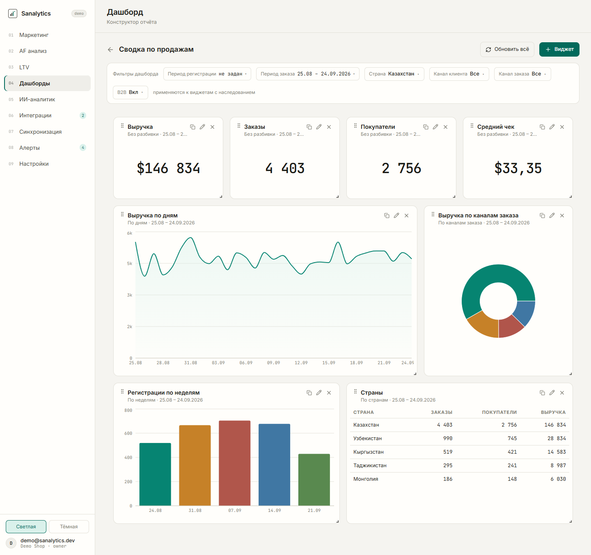
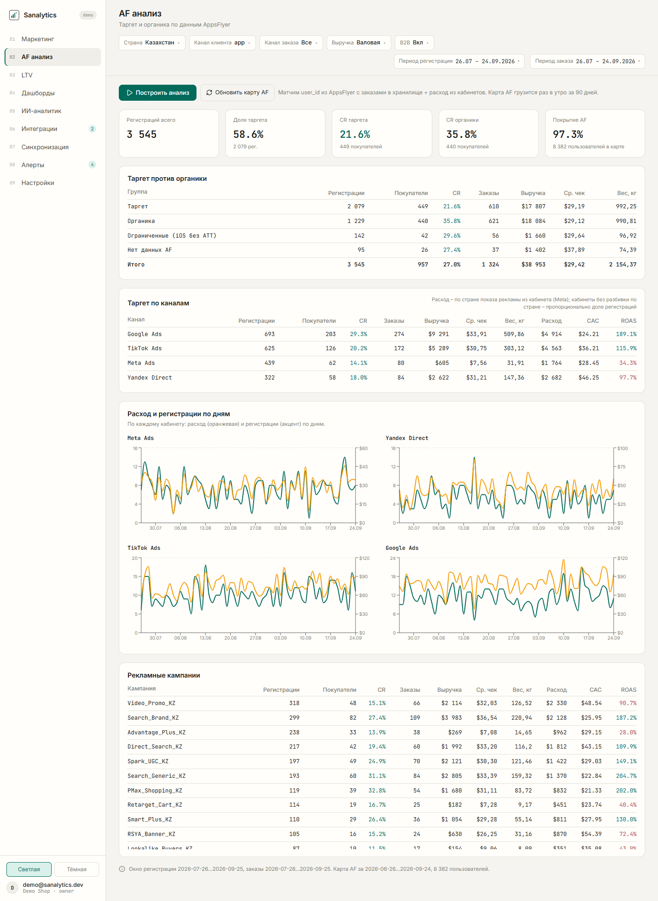
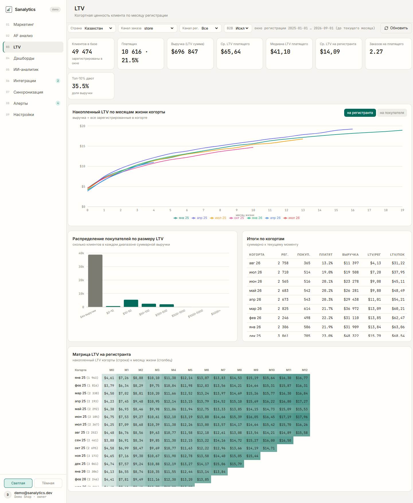
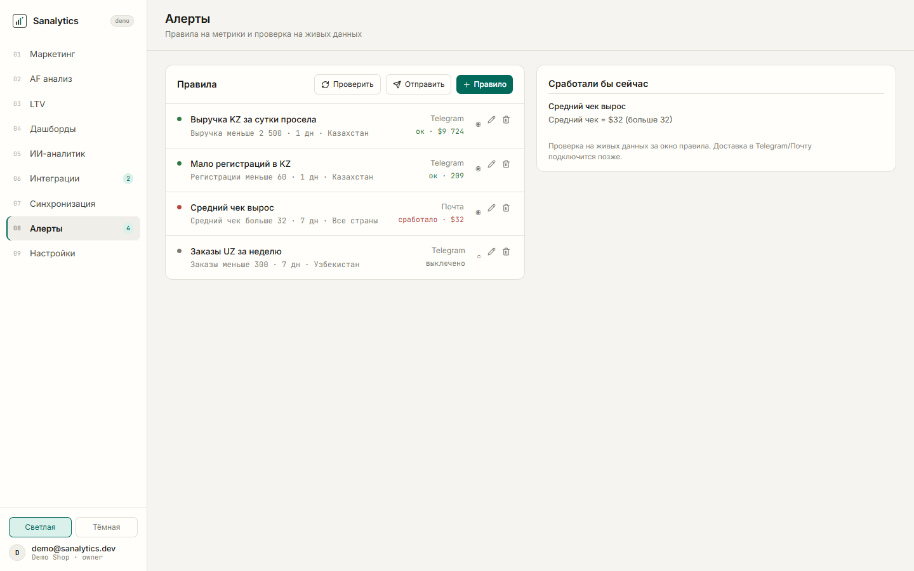

# Sanalytics (демо)

Sanalytics это BI-платформа для маркетинга e-commerce. Она собирает заказы, регистрации, данные MMP и расход рекламных кабинетов в один слой метрик, а поверх него строит дашборды, когортный LTV, алерты и ИИ-аналитика.

Это публичная демо-копия. Все цифры синтетические: их генерирует детерминированный генератор с фиксированным seed. Продакшен-версия работает на ClickHouse + PostgreSQL + Supabase + AppsFlyer. В демо эти сервисы заменены хранилищем в памяти, а интерфейсы слоя данных остались теми же, поэтому экраны, кеш и резолвер дашбордов работают без изменений.

## Возможности

- **Маркетинг.** KPI со сравнением с прошлым периодом и спарклайнами, график по дням, неделям и месяцам, фильтры по стране, каналу заказа, каналу регистрации, B2B и типу выручки, когортный режим по периоду регистрации с конверсией, воронка, каналы привлечения с ROAS, экспорт среза в Excel.
- **AF анализ.** Таргет против органики по карте MMP (user_id -> канал): регистрации, покупатели, CR, выручка, расход, CAC и ROAS по каналам и кампаниям, расход и регистрации по дням для каждого кабинета.
- **LTV.** Когортная ценность клиента на регистранта и на покупателя, кривые по месяцам жизни, распределение по размеру LTV, итоги по когортам, треугольная матрица.
- **Конструктор дашбордов.** Виджеты KPI, линия, область, столбцы, пирог, таблица и текст. Drag-and-drop и ресайз, фильтры уровня дашборда с наследованием, дублирование виджетов, метрика реактивации с настраиваемой спячкой. Общие дашборды открываются только для чтения.
- **ИИ-аналитик.** Claude с инструментами `get_metrics` и `get_channels` поверх слоя метрик. Агент отвечает только по числам из инструментов и показывает, какой срез взял. Без ключа Anthropic чат отвечает шаблоном, но по настоящим числам слоя метрик.
- **Алерты.** Правила на метрики, проверка на текущих данных, доставка в Telegram с антиспамом (уведомление на фронте срабатывания и не чаще раза в 6 часов).
- **Интеграции.** ClickHouse, PostgreSQL, AppsFlyer (несколько приложений на один токен), рекламные кабинеты Google Ads, Meta Ads, TikTok Ads и Yandex Direct по странам, Telegram. Секреты не уходят в браузер.
- **Синхронизация.** Кеш слоя метрик с TTL 10 минут, прогрев дефолтного среза по расписанию, журнал запусков.
- **Роли и гео-доступ.** Владелец, админ, маркетолог, наблюдатель. Маркетолог видит только свои страны: ограничение применяется в слое метрик, дашбордах, экспорте и инструментах ИИ.

## Архитектура



В демо блок «Источники» заменяет `src/lib/demo/`: генератор создаёт примерно 125 тысяч пользователей и столько же заказов с 2024 года по сегодня и хранит их колонками в typed arrays. Запросы слоя метрик выполняются как сканы по этим колонкам и отдают те же агрегаты, что SQL в продакшене.

## Стек

- Next.js 16 (App Router), React 19, TypeScript
- Tailwind CSS 4, Recharts, lucide-react, react-grid-layout, react-day-picker
- exceljs для экспорта
- Anthropic SDK (Claude, tool use)
- В продакшене: ClickHouse, PostgreSQL, Supabase (Auth + RLS + Realtime), AppsFlyer Pull API, API рекламных кабинетов

## Демо-режим

- Нет внешних сервисов: ни базы, ни Supabase, ни AppsFlyer, ни рекламных API. Приложение запускается офлайн.
- Входа нет. Все заходят как владелец `demo@sanalytics.dev`.
- Дашборды, алерты, настройки, кабинеты и пользователи хранятся в памяти процесса. После перезапуска сервера возвращается демо-содержимое.
- Проверка кабинетов, синк AppsFlyer и тест Telegram отвечают синтетикой и ничего не отправляют. Настоящие API-клиенты лежат в `src/lib/connectors/providers.ts` и `src/lib/appsflyer/pull.ts`, их включает переменная `SANALYTICS_LIVE_CONNECTORS=1`.
- Подключение к базе на экране Интеграций не настраивается.

## Запуск

```bash
npm install
npm run dev
```

Открыть http://localhost:3000. Лендинг на `/`, приложение начинается с `/marketing`.

Необязательные переменные (см. `.env.example`):

- `ANTHROPIC_API_KEY` включает настоящий ответ Claude в ИИ-аналитике.
- `SANALYTICS_LIVE_CONNECTORS=1` включает настоящие API-клиенты коннекторов.

Проверки:

```bash
npm run typecheck
npm run build
```

## Структура проекта

```
src/
  app/
    page.tsx              лендинг
    (app)/                экраны приложения с сайдбаром
      marketing/ af-analysis/ ltv/ dashboards/ ai/
      integrations/ sync/ alerts/ settings/
    api/                  route handlers (метрики, дашборды, алерты, экспорт, ИИ, коннекторы)
  components/             UI: KPI, графики, фильтры, конструктор, интеграции
  lib/
    metrics.ts            слой метрик (карточки, ряды, каналы, страны, реактивация)
    cache.ts              кеш с TTL и журнал запусков
    warm.ts               прогрев по расписанию (instrumentation.ts)
    queries/cards.ts      фильтры, разбор URL, форматирование
    dashboards/           модель, хранилище, резолвер данных виджета
    appsflyer/            карта MMP, анализ таргет/органика, Pull API клиент
    connectors/           кабинеты по странам, слой расхода, API-клиенты
    ltv/                  когортный LTV
    alerts/               правила, оценка, доставка
    ai/agent.ts           ИИ-агент с инструментами
    auth/                 роли и гео-доступ
    demo/                 генератор синтетических данных и демо-хранилища
```

## Скриншоты

Лендинг



Маркетинг



Конструктор дашбордов



AF анализ



LTV



Алерты



---

## English

Sanalytics is a BI platform for e-commerce marketing teams. It combines orders, sign-ups, MMP attribution and ad spend into a single metrics layer, and builds dashboards, cohort LTV, alerts and an AI analyst on top of it.

This repository is a public demo. All numbers are synthetic and come from a seeded, deterministic generator. The production version runs on ClickHouse, PostgreSQL, Supabase and AppsFlyer. Here those services are replaced by an in-memory columnar store behind the same data-layer interfaces, so the screens, the metrics cache and the dashboard resolver are unchanged.

What you can try: the marketing overview with period comparison and cohort mode, target vs organic analysis with CAC and ROAS per channel and campaign, cohort LTV curves and matrix, a drag-and-drop dashboard builder, rule-based alerts, and an AI analyst that uses tools over the metrics layer (Claude if `ANTHROPIC_API_KEY` is set, a templated answer with real demo numbers otherwise).

Run it with `npm install && npm run dev`, then open http://localhost:3000. No external services or keys are needed. Auth is disabled and everyone is the owner. Stores live in memory and reset on restart. Connector checks and syncs return synthetic data; set `SANALYTICS_LIVE_CONNECTORS=1` to use the real API clients.
