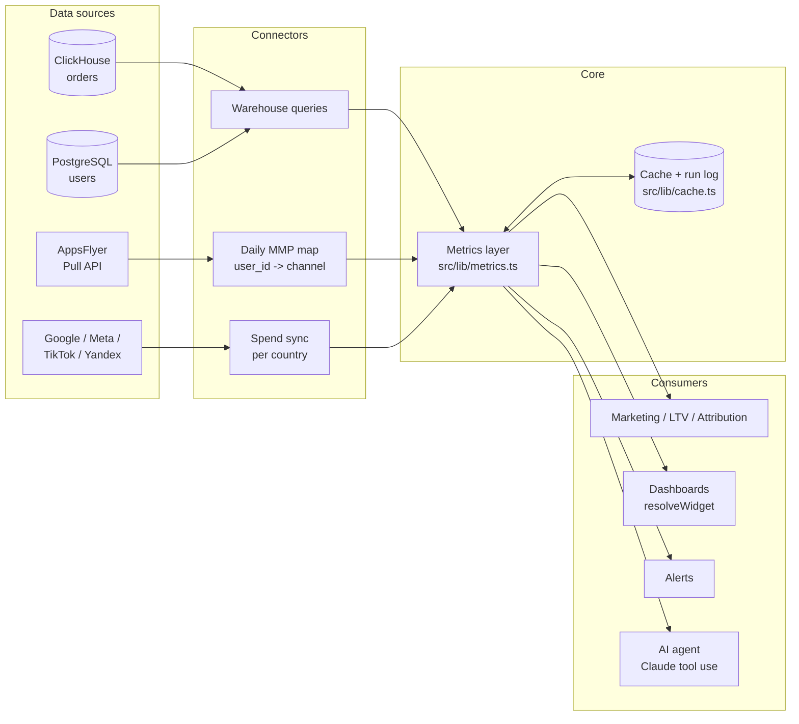
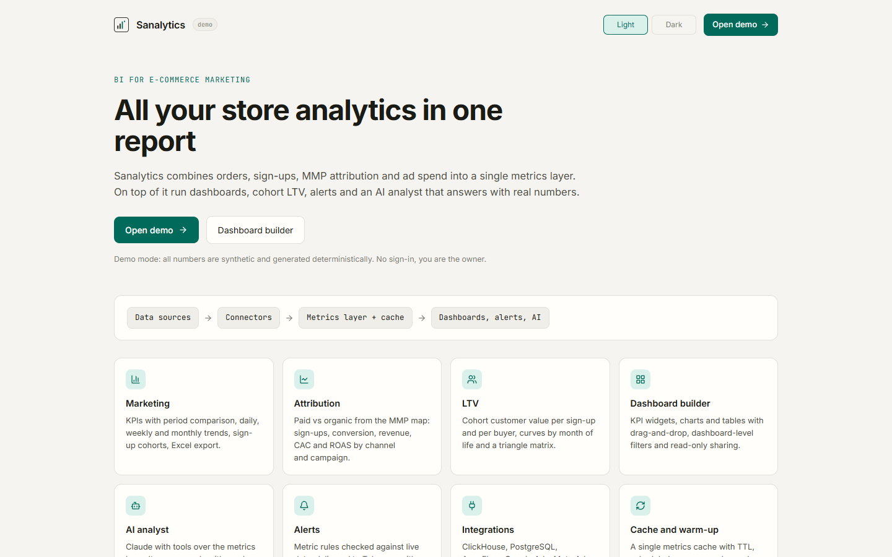
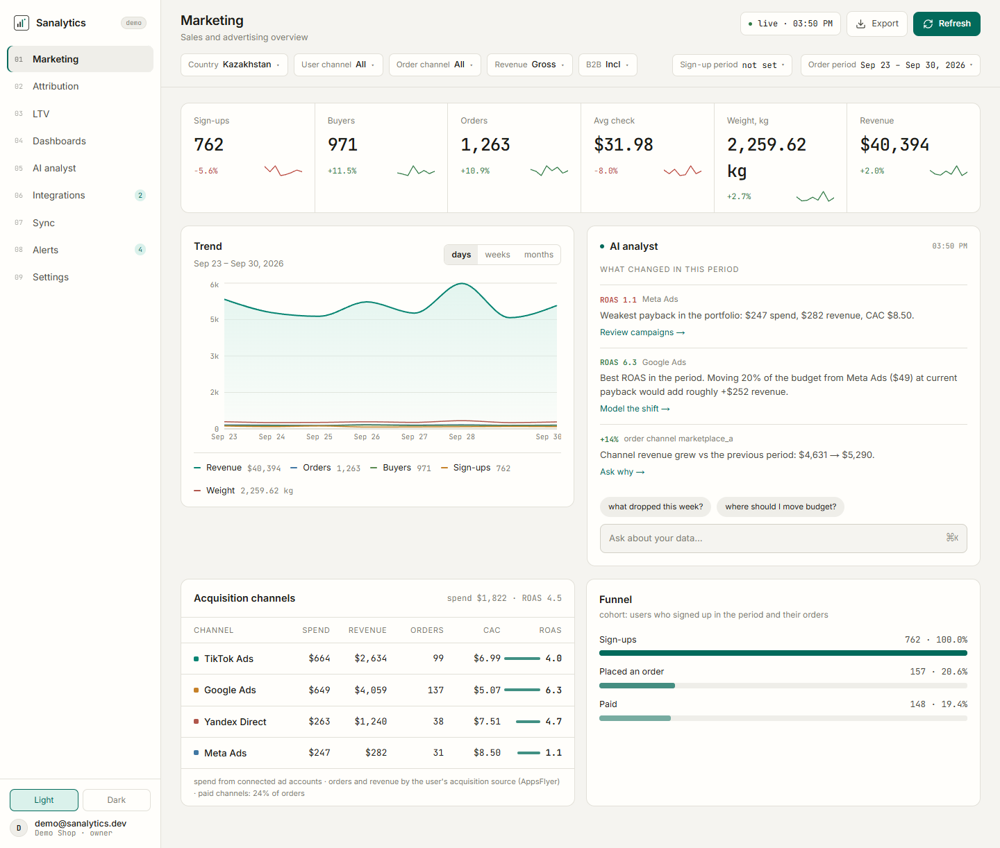
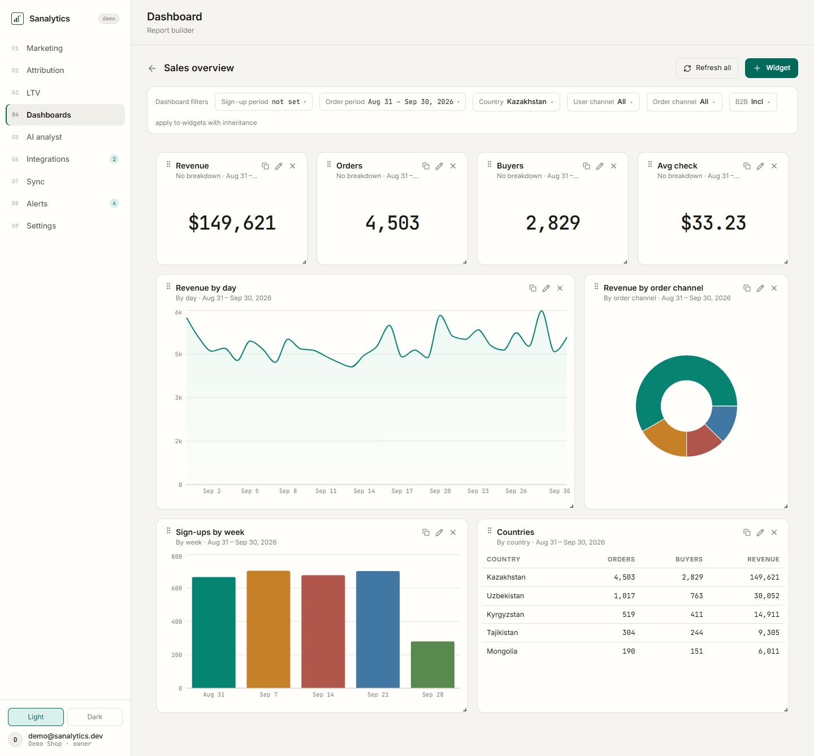
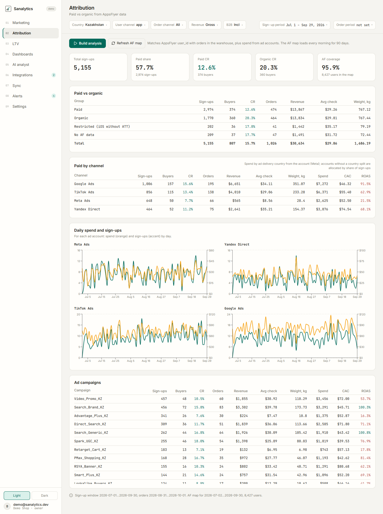
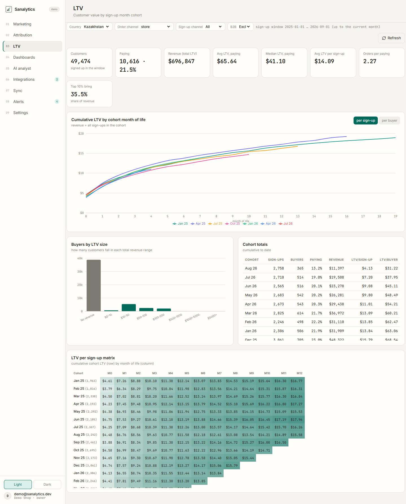
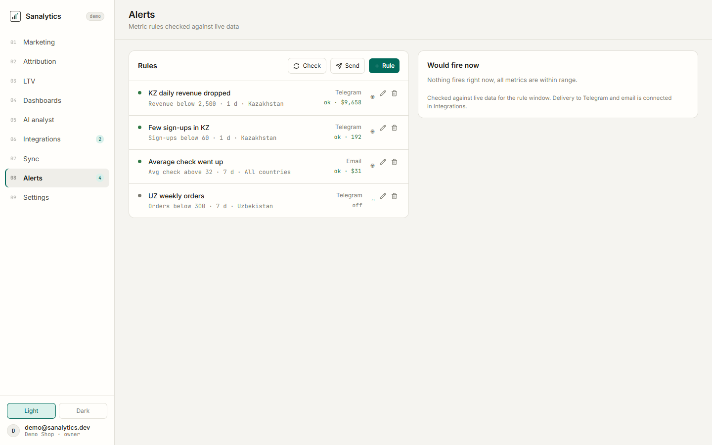

# Sanalytics (demo)

English · [Русский](README.ru.md)

**Live demo:** _link coming soon_

Sanalytics is a BI platform for e-commerce marketing teams. It combines orders, sign-ups, MMP attribution and ad spend into a single metrics layer, and builds dashboards, cohort LTV, alerts and an AI analyst on top of it.

This is a public demo. All numbers are synthetic and come from a deterministic generator with a fixed seed. The production version runs on ClickHouse + PostgreSQL + Supabase + AppsFlyer. In the demo those services are replaced by an in-memory store behind the same data-layer interfaces, so the screens, the cache and the dashboard resolver are unchanged.

## Features

- **Marketing.** KPIs with period comparison and sparklines, a chart by day, week or month, filters by country, order channel, sign-up channel, B2B and revenue basis, a cohort mode by sign-up period with conversion, a funnel, acquisition channels with ROAS, and Excel export of the current slice.
- **Attribution.** Paid vs organic from the MMP map (user_id -> channel): sign-ups, buyers, CR, revenue, spend, CAC and ROAS by channel and campaign, plus daily spend and sign-ups for each ad account.
- **LTV.** Cohort customer value per sign-up and per buyer, curves by month of life, distribution by LTV size, cohort totals and a triangle matrix.
- **Dashboard builder.** KPI, line, area, bar, pie, table and text widgets. Drag-and-drop and resize, dashboard-level filters with inheritance, widget duplication, and a reactivation metric with configurable dormancy. Shared dashboards open read-only.
- **AI analyst.** Claude with `get_metrics` and `get_channels` tools over the metrics layer. The agent answers only with numbers from its tools and shows which slice it used. Without an Anthropic key the chat returns a templated answer, still built from real metrics-layer numbers.
- **Alerts.** Metric rules checked against current data, delivered to Telegram with anti-spam (notifies on the rising edge and at most once every 6 hours).
- **Integrations.** ClickHouse, PostgreSQL, AppsFlyer (several apps per token), Google Ads, Meta Ads, TikTok Ads and Yandex Direct ad accounts per country, Telegram. Secrets never reach the browser.
- **Sync.** Metrics cache with a 10-minute TTL, scheduled warm-up of the default slice, and a run log.
- **Roles and geo access.** Owner, admin, marketer, viewer. A marketer sees only their countries: the restriction is enforced in the metrics layer, dashboards, export and AI tools.

## Architecture


```mermaid
flowchart LR
  subgraph Sources[Data sources]
    CH[(ClickHouse<br/>orders)]
    PG[(PostgreSQL<br/>users)]
    AF[AppsFlyer<br/>Pull API]
    ADS[Google / Meta /<br/>TikTok / Yandex]
  end
  subgraph Connectors
    Q[Warehouse queries]
    MAP[Daily MMP map<br/>user_id -> channel]
    SPEND[Spend sync<br/>per country]
  end
  subgraph Core
    M[Metrics layer<br/>src/lib/metrics.ts]
    C[(Cache + run log<br/>src/lib/cache.ts)]
  end
  subgraph UI[Consumers]
    MK[Marketing / LTV / Attribution]
    D[Dashboards<br/>resolveWidget]
    AL[Alerts]
    AI[AI agent<br/>Claude tool use]
  end
  CH --> Q
  PG --> Q
  AF --> MAP
  ADS --> SPEND
  Q --> M
  MAP --> M
  SPEND --> M
  M <--> C
  M --> MK
  M --> D
  M --> AL
  M --> AI
```

In the demo, the Data sources block is replaced by `src/lib/demo/`: the generator creates about 125 thousand users and as many orders from 2024 to today and stores them as columns in typed arrays. Metrics-layer queries run as scans over these columns and return the same aggregates as the SQL in production.

## Stack

- Next.js 16 (App Router), React 19, TypeScript
- Tailwind CSS 4, Recharts, lucide-react, react-grid-layout, react-day-picker
- exceljs for export
- Anthropic SDK (Claude, tool use)
- In production: ClickHouse, PostgreSQL, Supabase (Auth + RLS + Realtime), AppsFlyer Pull API, ad platform APIs

## Demo mode

- No external services: no database, Supabase, AppsFlyer or ad APIs. The app runs offline.
- No sign-in. Everyone is the owner `demo@sanalytics.dev`.
- Dashboards, alerts, settings, ad accounts and users live in process memory. After a server restart the demo content comes back.
- Ad account checks, the AppsFlyer sync and the Telegram test return synthetic data and send nothing. The real API clients live in `src/lib/connectors/providers.ts` and `src/lib/appsflyer/pull.ts` and are enabled by `SANALYTICS_LIVE_CONNECTORS=1`.
- The database connection is not configurable on the Integrations screen.

## Running locally

```bash
npm install
npm run dev
```

Open http://localhost:3000. The landing page is at `/`, the app starts at `/marketing`.

Optional variables (see `.env.example`):

- `ANTHROPIC_API_KEY` enables real Claude answers in the AI analyst.
- `SANALYTICS_LIVE_CONNECTORS=1` enables the real connector API clients.

Checks:

```bash
npm run typecheck
npm run build
```

## Project structure

```
src/
  app/
    page.tsx              landing page
    (app)/                app screens with the sidebar
      marketing/ af-analysis/ ltv/ dashboards/ ai/
      integrations/ sync/ alerts/ settings/
    api/                  route handlers (metrics, dashboards, alerts, export, AI, connectors)
  components/             UI: KPIs, charts, filters, builder, integrations
  lib/
    metrics.ts            metrics layer (cards, series, channels, countries, reactivation)
    cache.ts              TTL cache and run log
    warm.ts               scheduled warm-up (instrumentation.ts)
    queries/cards.ts      filters, URL parsing, formatting
    dashboards/           model, store, widget data resolver
    appsflyer/            MMP map, paid vs organic analysis, Pull API client
    connectors/           ad accounts per country, spend layer, API clients
    ltv/                  cohort LTV
    alerts/               rules, evaluation, delivery
    ai/agent.ts           AI agent with tools
    auth/                 roles and geo access
    demo/                 synthetic data generator and demo stores
```

## Screenshots

Landing page



Marketing



Dashboard builder



Attribution



LTV



Alerts


